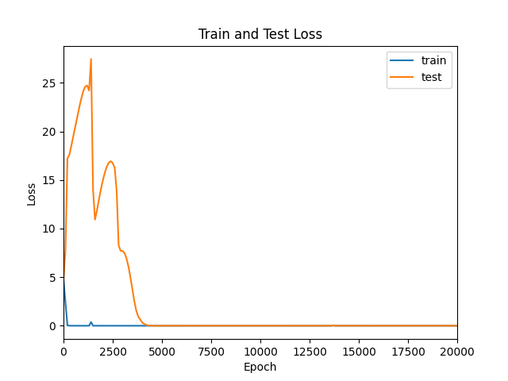
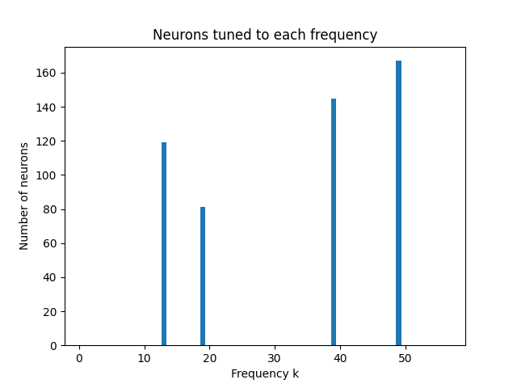
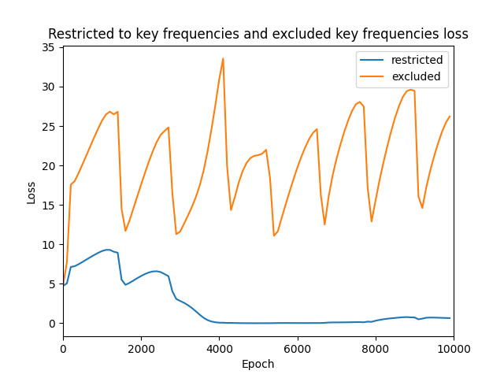

# Grokking Mechanistic Interpretability

Replication of [Progress Measures for Grokking via Mechanistic Interpretability](https://arxiv.org/abs/2301.05217) (Nanda et al., ICLR 2023).

## What is this?

A 1-layer transformer trained from scratch on modular addition (mod 113)  memorizes the training data quickly, then generalizes later (in this case, a few thousand epochs later). This project reverse-engineers the algorithm with Fourier analysis.

## What I built

- Transformer (`transformer.py`). Embedding, multi-head attention, MLP, unembedding, no external libraries.
- Training pipeline (`train.py`). AdamW with weight decay. Matches paper's setup.
- Fourier analysis (`analysis.ipynb`). A bunch of linear algebra to identify key vectors in the Fourier basis.

## Key findings

The embedding matrix concentrates its energy on a sparse set of key frequencies (13, 19, 35, 39, 49), and individual MLP neurons are tuned to specific frequencies in that set.

Restricting logits to key-frequency Fourier basis vectors preserves the model's ability to predict / do the computation; excluding the key-frequency Fourier basis vectors makes the model unable to predict (and in fact, confidently wrong). The losses are ~1.1 and ~17.9, respectively.

In the original paper, progress measures reveal three training phases. In this replication the phases are less clearly visible, but it seems that the restricted loss does improve somewhat before test accuracy jumps.

## File structure

- `transformer.py`: model definition
- `data.py`: data generation (mod-113 addition, train/test split)
- `train.py`: training loop (40k epochs)
- `train_checkpoints.py`: training with progress measure logging (10k epochs)
- `analysis.ipynb`: Fourier analysis, neuron analysis, visualizations